# Smart Booking System - Complete System Flowchart

## Comprehensive Project Flowchart

```mermaid
flowchart TD
    Start([User Visits App]) --> CheckAuth{User<br/>Authenticated?}

    CheckAuth -->|No| AuthChoice{Action?}
    AuthChoice -->|Sign In| SignIn["Sign In Page<br/>Email/Password"]
    AuthChoice -->|Sign Up| SignUp["Sign Up Page<br/>Email/Password<br/>Role Selection"]
    AuthChoice -->|Continue as Guest| PublicAccess

    SignIn --> ClerkAuth1["Clerk Authentication<br/>Verify Credentials"]
    SignUp --> ClerkAuth2["Clerk Authentication<br/>Create Account<br/>Assign Role"]

    ClerkAuth1 --> GetRole["Retrieve User Role<br/>from Clerk Metadata"]
    ClerkAuth2 --> GetRole

    GetRole --> RoleCheck{User Role?}

    CheckAuth -->|Yes| RoleCheck

    RoleCheck -->|Admin| AdminDash["Admin Dashboard<br/>System Management"]
    RoleCheck -->|Client| ClientChoice{Client Action?}
    RoleCheck -->|Customer| PublicAccess

    PublicAccess["Public Access<br/>No Auth Required"] --> HomeChoice{User Action?}

    HomeChoice -->|Browse Shops| ViewAllShops["View All Businesses<br>/shop/all"]
    HomeChoice -->|Search/Filter| SearchShops["Search by Name<br/>Filter by Category<br/>Sort Options"]
    SearchShops --> ViewAllShops

    ViewAllShops --> SelectShop["Click Business Card<br/>View Shop Details"]
    SelectShop --> ShopDetail["Shop Detail Page<br/>Display:<br/>Services<br/>Employees<br/>Business Hours<br/>Contact Info"]

    ShopDetail --> BookChoice{User Action?}
    BookChoice -->|Browse Only| ViewAllShops
    BookChoice -->|Book Service| StartBooking["Initialize Booking<br/>Flow"]

    StartBooking --> SelectService["Select Service<br/>View:<br/>Name<br/>Duration<br/>Price<br/>Description"]
    SelectService --> SelectEmployee["Choose Employee<br/>View Available<br/>Staff Members"]
    SelectEmployee --> SelectDate["Select Appointment Date<br/>Calendar Widget<br/>Only Future Dates<br/>Highlight Available Days"]

    SelectDate --> CheckAvail["Query Availability<br/>Check by_date_employee<br/>Index in Database"]
    CheckAvail --> AvailCheck{Slots<br/>Available?}

    AvailCheck -->|No Available Slots| NoSlots["Show Message:<br/>No Available Times<br/>Suggest Other Dates"]
    NoSlots --> SelectDate

    AvailCheck -->|Slots Available| SelectTime["Display Available<br/>Time Slots<br/>Filter by:<br/>Business Hours<br/>Employee Schedule<br/>Service Duration"]
    SelectTime --> SelectTimeSlot["Customer Selects<br/>Time Slot"]

    SelectTimeSlot --> ClientInfo["Enter Client Information<br/>Form Fields:<br/>Name<br/>Email<br/>Phone<br/>Notes Optional"]

    ClientInfo --> ValidateClient{Validate<br/>Input?}
    ValidateClient -->|Invalid| ShowErrors["Display Validation<br/>Errors"]
    ShowErrors --> ClientInfo

    ValidateClient -->|Valid| ReviewBooking["Review Booking<br/>Summary Display:<br/>Service Name<br/>Employee Name<br/>Date & Time<br/>Price<br/>Client Info"]

    ReviewBooking --> ConfirmChoice{Confirm<br/>Booking?}
    ConfirmChoice -->|Cancel| ViewAllShops
    ConfirmChoice -->|Confirm| CreateAppointment["Create Appointment<br/>Insert into Database<br/>Status: Pending<br/>Generate Booking Ref"]

    CreateAppointment --> SendEmail["Send Confirmation Email<br/>to Customer<br/>Include:<br/>Booking Details<br/>Booking Reference<br/>Business Contact"]

    SendEmail --> ConfirmPage["Show Confirmation Page<br/>Display:<br/>Success Message<br/>Booking Reference<br/>Booking Details<br/>Options:<br/>Add to Calendar<br/>Share Booking<br/>View Other Services"]

    ConfirmPage --> AfterBook{Next Action?}
    AfterBook -->|Browse More| ViewAllShops
    AfterBook -->|Exit| Start

    AdminDash --> AdminChoice{Admin Action?}

    AdminChoice -->|View All Users| UserList["Display User List<br/>Columns:<br/>Name<br/>Email<br/>Current Role<br/>Created Date"]

    UserList --> UserActions{User Action?}
    UserActions -->|Update Role| SelectRole["Change User Role<br/>Options:<br/>Admin<br/>Client"]
    SelectRole --> UpdateRole["Update Role in Database<br/>Update Clerk Metadata"]
    UpdateRole --> UserList
    UserActions -->|View All Users| UserList
    UserActions -->|Back to Admin| AdminDash

    AdminChoice -->|View Businesses| BusinessList["Display All Businesses<br/>Columns:<br/>Name<br/>Owner<br/>Category<br/>Created Date<br/>Status"]

    BusinessList --> BizActions{Business Action?}
    BizActions -->|View Details| BizDetail["View Business Details<br/>Services<br/>Employees<br/>Appointments"]
    BizActions -->|Edit Info| EditBiz["Edit Business Information"]
    EditBiz --> UpdateBiz["Update Business<br/>in Database"]
    UpdateBiz --> BusinessList
    BizActions -->|Delete| DeleteBiz["Delete Business<br/>Soft Delete or<br/>Archive"]
    DeleteBiz --> BusinessList
    BizActions -->|Back to Admin| AdminDash

    AdminChoice -->|View Statistics| Stats["System Statistics<br/>Display:<br/>Total Users<br/>Total Businesses<br/>Total Appointments<br/>Revenue Overview<br/>Growth Metrics"]
    Stats --> AdminDash

    AdminChoice -->|Logout| Start

    ClientChoice -->|Dashboard| Dashboard["Business Dashboard<br/>Display:<br/>Total Appointments<br/>Completed vs Pending<br/>Total Customers<br/>Revenue Overview"]

    Dashboard --> ViewCharts["View Analytics Charts<br/>Appointment Trends<br/>Revenue Trends<br/>Customer Growth"]
    ViewCharts --> RecentBookings["Recent Bookings List<br/>Last 10 Appointments<br/>Client Name<br/>Service<br/>Date/Time<br/>Status"]
    RecentBookings --> DashNext{Next Action?}

    DashNext -->|Manage Services| ManageServices
    DashNext -->|Manage Employees| ManageEmployees
    DashNext -->|Manage Appointments| ManageAppointments
    DashNext -->|View Settings| ManageSettings
    DashNext -->|Logout| Start

    ManageServices["Services Management<br/>Display Service List:<br/>Name<br/>Duration<br/>Price<br/>Category"]

    ManageServices --> ServiceChoice{Service Action?}
    ServiceChoice -->|Create New| AddService["Add Service Form<br/>Fields:<br/>Name<br/>Duration Minutes<br/>Price<br/>Category<br/>Description"]
    AddService --> ValidateService{Validate?}
    ValidateService -->|Invalid| AddService
    ValidateService -->|Valid| CreateService["Insert Service<br/>into Database"]
    CreateService --> ManageServices

    ServiceChoice -->|Edit| SelectEditService["Select Service<br/>to Edit"]
    SelectEditService --> EditService["Edit Service Form<br/>Update Fields"]
    EditService --> ValidateEdit{Validate?}
    ValidateEdit -->|Invalid| EditService
    ValidateEdit -->|Valid| UpdateService["Update Service<br/>in Database"]
    UpdateService --> ManageServices

    ServiceChoice -->|Delete| SelectDelService["Select Service<br/>to Delete"]
    SelectDelService --> ConfirmDelete{Confirm<br/>Delete?}
    ConfirmDelete -->|Cancel| ManageServices
    ConfirmDelete -->|Confirm| DeleteService["Delete Service<br/>from Database"]
    DeleteService --> ManageServices

    ServiceChoice -->|Back| DashNext

    ManageEmployees["Employee Management<br/>Display Employee List:<br/>Name<br/>Email<br/>Photo<br/>Available Times"]

    ManageEmployees --> EmpChoice{Employee Action?}
    EmpChoice -->|Add Employee| AddEmp["Add Employee Form<br/>Fields:<br/>Name<br/>Email<br/>Photo URL<br/>Available Times"]
    AddEmp --> ValidateEmp{Validate?}
    ValidateEmp -->|Invalid| AddEmp
    ValidateEmp -->|Valid| CreateEmp["Insert Employee<br/>into Database"]
    CreateEmp --> ManageEmployees

    EmpChoice -->|Edit| SelectEditEmp["Select Employee<br/>to Edit"]
    SelectEditEmp --> EditEmp["Edit Employee Form<br/>Update Fields"]
    EditEmp --> ValidateEmpEdit{Validate?}
    ValidateEmpEdit -->|Invalid| EditEmp
    ValidateEmpEdit -->|Valid| UpdateEmp["Update Employee<br/>in Database"]
    UpdateEmp --> ManageEmployees

    EmpChoice -->|Delete| SelectDelEmp["Select Employee<br/>to Delete"]
    SelectDelEmp --> ConfirmDelEmp{Confirm<br/>Delete?}
    ConfirmDelEmp -->|Cancel| ManageEmployees
    ConfirmDelEmp -->|Confirm| DeleteEmp["Delete Employee<br/>from Database"]
    DeleteEmp --> ManageEmployees

    EmpChoice -->|Back| DashNext

    ManageAppointments["Appointment Management<br/>Display Appointment List:<br/>Client Name<br/>Service<br/>Date/Time<br/>Employee<br/>Status"]

    ManageAppointments --> AppFilters["Apply Filters<br/>By Status<br/>By Date Range<br/>By Employee"]
    AppFilters --> SortAppointments["Sort Appointments<br/>By Date<br/>By Status<br/>By Client"]
    SortAppointments --> FilteredAppointments["Display Filtered &<br/>Sorted Appointments"]

    FilteredAppointments --> AppAction{Appointment Action?}

    AppAction -->|View Details| AppDetail["View Full Appointment<br/>Client Details<br/>Service Details<br/>Employee Name<br/>Date & Time<br/>Status<br/>Notes"]
    AppDetail --> AppNext{Next Action?}
    AppNext -->|Update Status| UpdateStatus
    AppNext -->|Back| FilteredAppointments

    AppAction -->|Update Status| UpdateStatus["Change Appointment Status<br/>Options:<br/>Pending → Confirmed<br/>Confirmed → Done<br/>Any → Cancelled"]

    UpdateStatus --> SelectNewStatus["Select New Status"]
    SelectNewStatus --> ConfirmStatus{Confirm<br/>Change?}
    ConfirmStatus -->|Cancel| FilteredAppointments
    ConfirmStatus -->|Confirm| SaveStatus["Save Status<br/>to Database"]
    SaveStatus --> NotifyCustomer["Send Notification Email<br/>to Customer<br/>Status Update Details"]
    NotifyCustomer --> FilteredAppointments

    AppAction -->|Cancel Appointment| CancelApp["Cancel Appointment<br/>Optional Reason"]
    CancelApp --> ConfirmCancel{Confirm<br/>Cancellation?}
    ConfirmCancel -->|No| FilteredAppointments
    ConfirmCancel -->|Yes| SaveCancel["Update Status: Cancelled<br/>Mark Slot Available"]
    SaveCancel --> NotifyCancel["Send Cancellation Email<br/>to Customer"]
    NotifyCancel --> FilteredAppointments

    AppAction -->|Back| DashNext

    ManageSettings["Business Settings<br/>Edit:<br/>Business Name<br/>Description<br/>Category<br/>Address<br/>Phone<br/>Logo URL<br/>Opening Hours<br/>Closing Hours"]

    ManageSettings --> EditSettings["Update Business<br/>Information"]
    EditSettings --> ValidateSettings{Validate?}
    ValidateSettings -->|Invalid| ManageSettings
    ValidateSettings -->|Valid| SaveSettings["Save Settings<br/>to Database"]
    SaveSettings --> SettingsSuccess["Show Success Message<br/>Settings Updated"]
    SettingsSuccess --> ManageSettings

    ManageSettings --> MoreSettings{More<br/>Actions?}
    MoreSettings -->|Edit Profile| ManageSettings
    MoreSettings -->|Back| DashNext
    MoreSettings -->|Logout| Start

    style Start fill:#90EE90
    style CheckAuth fill:#87CEEB
    style RoleCheck fill:#87CEEB
    style AuthChoice fill:#FFB6C1
    style AdminDash fill:#DDA0DD
    style Dashboard fill:#F0E68C
    style PublicAccess fill:#90EE90
    style CreateAppointment fill:#98FB98
    style SendEmail fill:#98FB98
    style ConfirmPage fill:#98FB98
    style CreateService fill:#B0E0E6
    style CreateEmp fill:#B0E0E6
    style SaveStatus fill:#FFB6C1
    style SaveCancel fill:#FFB6C1
```



---

## System Flow Summary

### User Journey Paths

#### 1. **Customer Journey (Public User)**

```
Browse Shops → Search/Filter → View Shop Details →
Select Service → Choose Employee → Pick Date → Pick Time →
Enter Information → Review → Confirm →
Create Appointment → Receive Email → View Confirmation
```

#### 2. **Business Owner Journey (Client User)**

```
Login → Dashboard →
Choose Action:
  - View Analytics & Charts
  - Manage Services (Create/Edit/Delete)
  - Manage Employees (Create/Edit/Delete)
  - Manage Appointments (View/Update Status/Cancel)
  - Edit Settings (Business Info & Hours)
→ Logout
```

#### 3. **Administrator Journey (Admin User)**

```
Login → Admin Dashboard →
Choose Action:
  - Manage Users (View/Update Roles)
  - Manage Businesses (View/Edit/Delete)
  - View System Statistics
→ Logout
```

### Data Processing Flows

#### Booking Creation Flow

```
Client Submits Booking
↓
Frontend Validates Input
↓
Check Availability (Query Index: by_date_employee)
↓
No Conflicts Found?
  ├─ No → Show Error, Suggest Alternatives
  └─ Yes → Create Appointment Record
    ↓
    Set Status: Pending
    ↓
    Generate Booking Reference
    ↓
    Send Confirmation Email
    ↓
    Return Success Response
```

#### Appointment Status Update Flow

```
Owner Selects Status Change
↓
Frontend Confirms Action
↓
Database Updates Status
↓
Send Notification Email
↓
Update UI with New Status
↓
Confirm to User
```

### Key Decision Points in System

| Decision Point           | Options                    | Outcome                               |
| ------------------------ | -------------------------- | ------------------------------------- |
| **Authentication**       | Sign In / Sign Up / Guest  | Route to appropriate area             |
| **User Role**            | Admin / Client / Customer  | Determine access level                |
| **Availability Check**   | Slots Available / No Slots | Allow booking or suggest alternatives |
| **Booking Confirmation** | Confirm / Cancel           | Create appointment or discard         |
| **Status Update**        | Confirm / Cancel           | Save new status or keep current       |
| **Appointment Action**   | View / Update / Cancel     | Perform corresponding action          |

### External Integrations

1. **Clerk Authentication**
   - User registration
   - Login/Logout
   - JWT token generation
   - Role metadata management

2. **Email Service**
   - Booking confirmation emails
   - Status change notifications
   - Password reset emails
   - Cancellation notifications

3. **Database (Convex)**
   - Store all application data
   - Query/Mutation operations
   - Index-based lookups
   - Real-time data validation

### Performance Checkpoints

- **Page Load:** <2 seconds
- **API Response:** <500ms
- **Availability Check:** <500ms
- **Email Delivery:** Within 5 seconds
- **Status Update:** Real-time UI update

---

This comprehensive flowchart visualizes the complete journey of the Smart Booking System, including all user paths, data flows, decision points, and external integrations.
