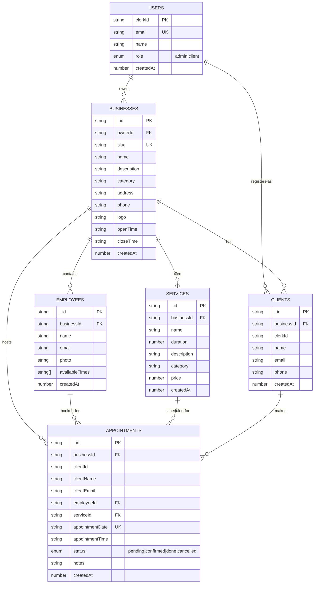

# Smart Booking System - Entity Relationship Diagram

## Database Schema Overview

## Key Relationships

| Relationship                  | Description                                        |
| ----------------------------- | -------------------------------------------------- |
| **Users → Businesses**        | One user (owner) can have multiple businesses      |
| **Businesses → Employees**    | One business can have multiple employees           |
| **Businesses → Services**     | One business can offer multiple services           |
| **Businesses → Clients**      | One business can have multiple clients             |
| **Businesses → Appointments** | One business can host multiple appointments        |
| **Employees → Appointments**  | One employee can have multiple appointments        |
| **Services → Appointments**   | One service can be booked in multiple appointments |
| **Clients → Appointments**    | One client can make multiple appointments          |

## Indexes

The following indexes are defined for optimal query performance:

- **users.by_clerkId**: Query users by Clerk ID
- **users.by_role**: Query users by role (admin/client)
- **businesses.by_ownerId**: Query businesses owned by a user
- **businesses.by_slug**: Query business by slug (public URL)
- **businesses.by_createdAt**: Query businesses by creation date
- **employees.by_businessId**: Query employees in a business
- **services.by_businessId**: Query services offered by a business
- **clients.by_businessId**: Query clients of a business
- **appointments.by_businessId**: Query appointments for a business
- **appointments.by_date_employee**: Query appointments by date and employee (for scheduling)

## Data Types

- **PK** = Primary Key
- **FK** = Foreign Key
- **UK** = Unique Key
- All IDs are strings (Convex document IDs)
- Timestamps are stored as Unix milliseconds (number)

## Access Control

- **Admin**: Can manage all businesses and users
- **Client**: Can own businesses and book appointments
- Authentication is handled via Clerk

See [FLOWCHART.md](FLOWCHART.md) for system process flowcharts.
