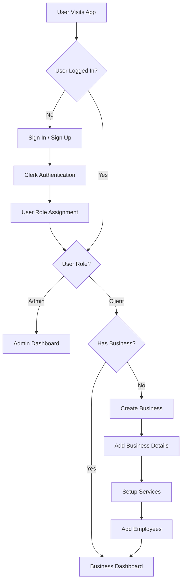
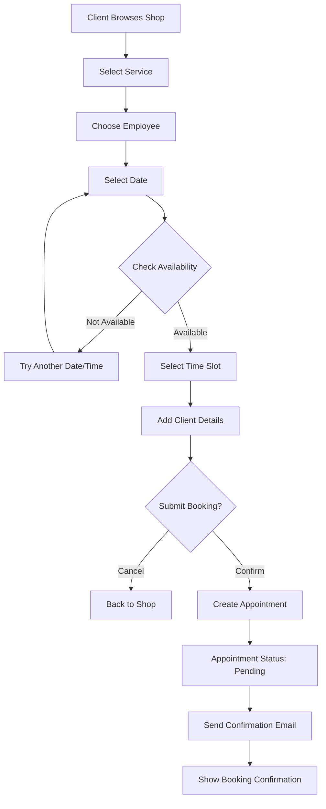
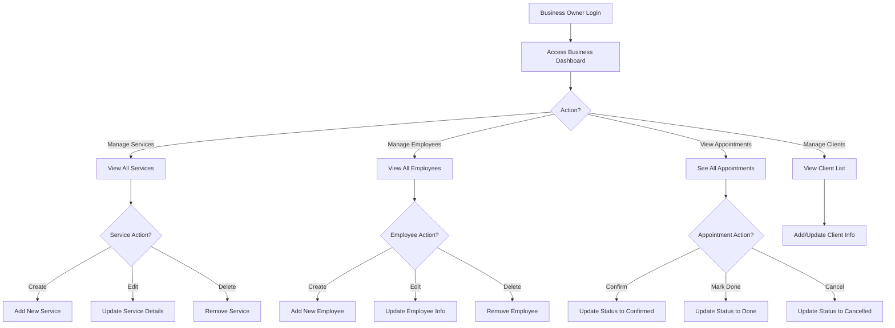
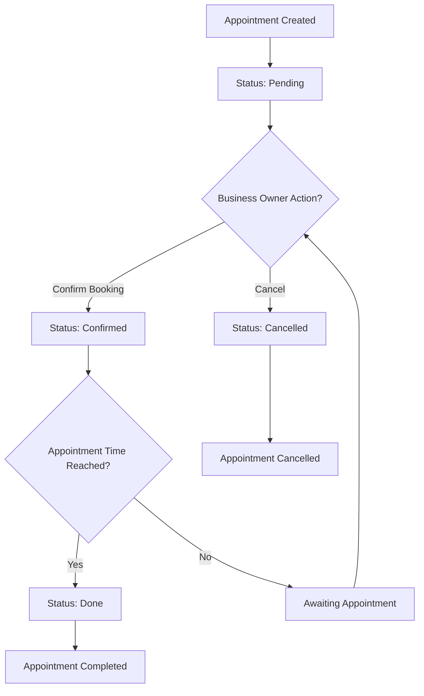
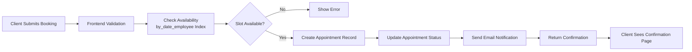
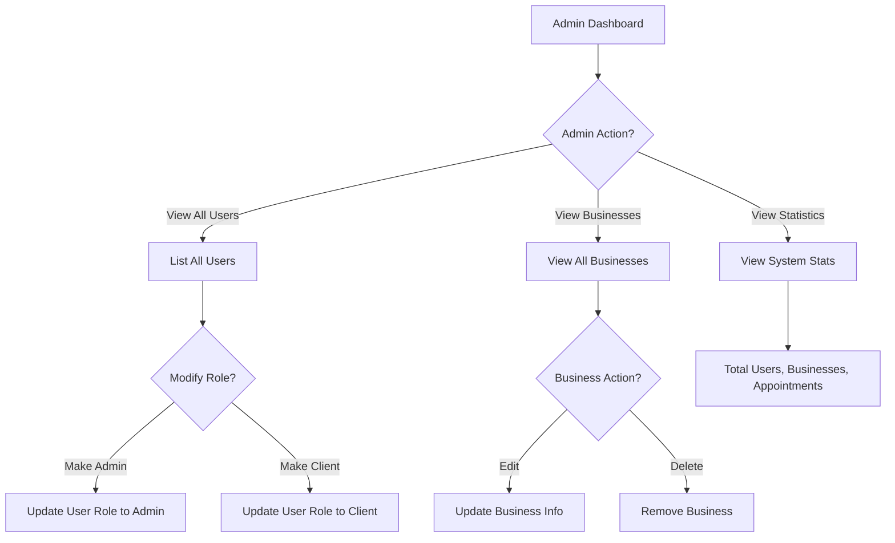

# Smart Booking System - Process Flowcharts

## User Authentication & Onboarding Flow

## Client Appointment Booking Flow

## Business Owner Management Flow

## Appointment Status Lifecycle

## Data Flow for Booking

## Admin User Management Flow

