# Smart Booking System - Structure Chart

## 1. System Architecture Overview

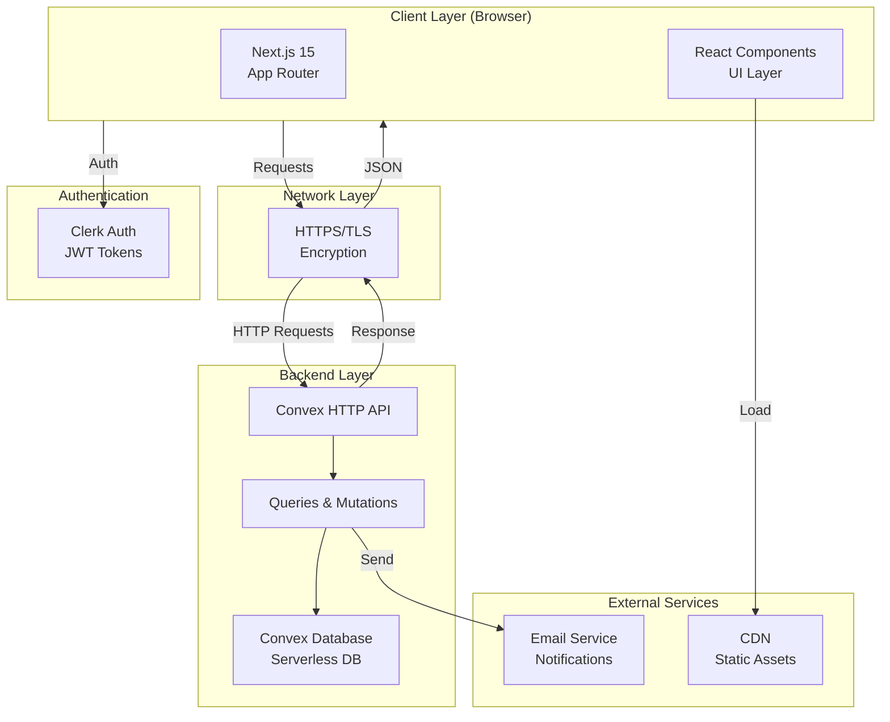

## 2. Frontend Architecture Structure

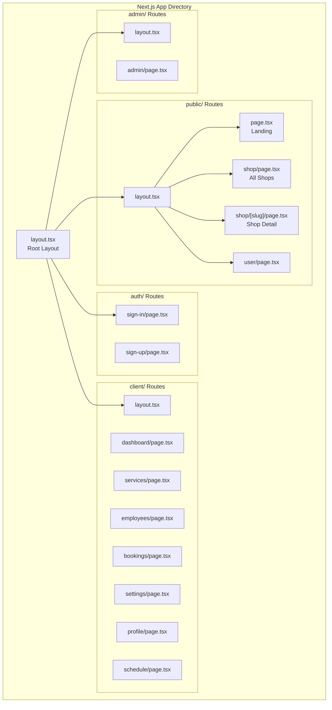

## 3. Component Hierarchy

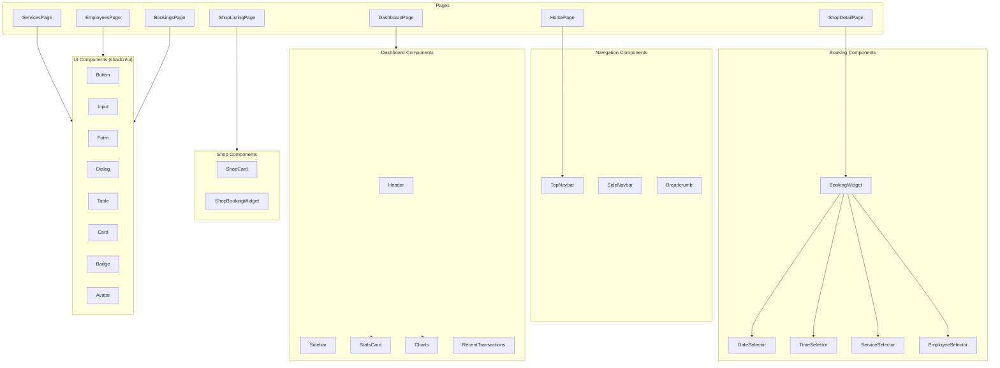

## 4. Backend Structure (Convex)

```mermaid
graph TD
    subgraph Schema["Schema Definition"]
        SchemaDef["schema.ts<br/>Database Schema"]

        Users["users<br/>Authentication"]
        Businesses["businesses<br/>Shop Profile"]
        Employees["employees<br/>Staff"]
        Services["services<br/>Offerings"]
        Clients["clients<br/>Customers"]
        Appointments["appointments<br/>Bookings"]
    end

    subgraph Queries["Query Functions"]
        QAuth["getBusinessForClerk"]
        QBusiness["getBusinessById<br/>getBusinessBySlug<br/>getBusinessStats"]
        QEmployees["listEmployeesForBusiness<br/>getEmployeeById"]
        QServices["listServicesForBusiness<br/>getServiceById"]
        QClients["listClientsForBusiness"]
        QAppointments["getAppointmentsForBusiness<br/>getAppointmentsByCustomerEmail<br/>getAppointmentsByBusiness"]
        QUsers["listAllUsers"]
    end

    subgraph Mutations["Mutation Functions"]
        MBusiness["createBusiness<br/>updateBusiness"]
        MEmployees["createEmployee<br/>updateEmployee<br/>deleteEmployee"]
        MServices["createService<br/>updateService<br/>deleteService"]
        MAppointments["bookAppointment<br/>updateAppointmentStatus"]
        MAuth["updateUserRole<br/>updateUserRoleWithClerk"]
    end

    subgraph Helpers["Helper Functions"]
        RoleHelper["requireRole.ts<br/>requireAuth"]
    end

    SchemaDef --> Users
    SchemaDef --> Businesses
    SchemaDef --> Employees
    SchemaDef --> Services
    SchemaDef --> Clients
    SchemaDef --> Appointments

    QBusiness --> Businesses
    QEmployees --> Employees
    QServices --> Services
    QClients --> Clients
    QAppointments --> Appointments

    MBusiness --> Businesses
    MEmployees --> Employees
    MServices --> Services
    MAppointments --> Appointments

    MAuth --> RoleHelper
```

## 5. Data Flow Architecture

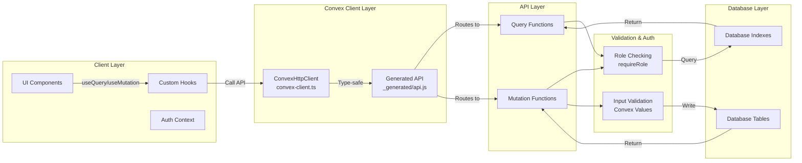

## 6. Frontend Module Structure

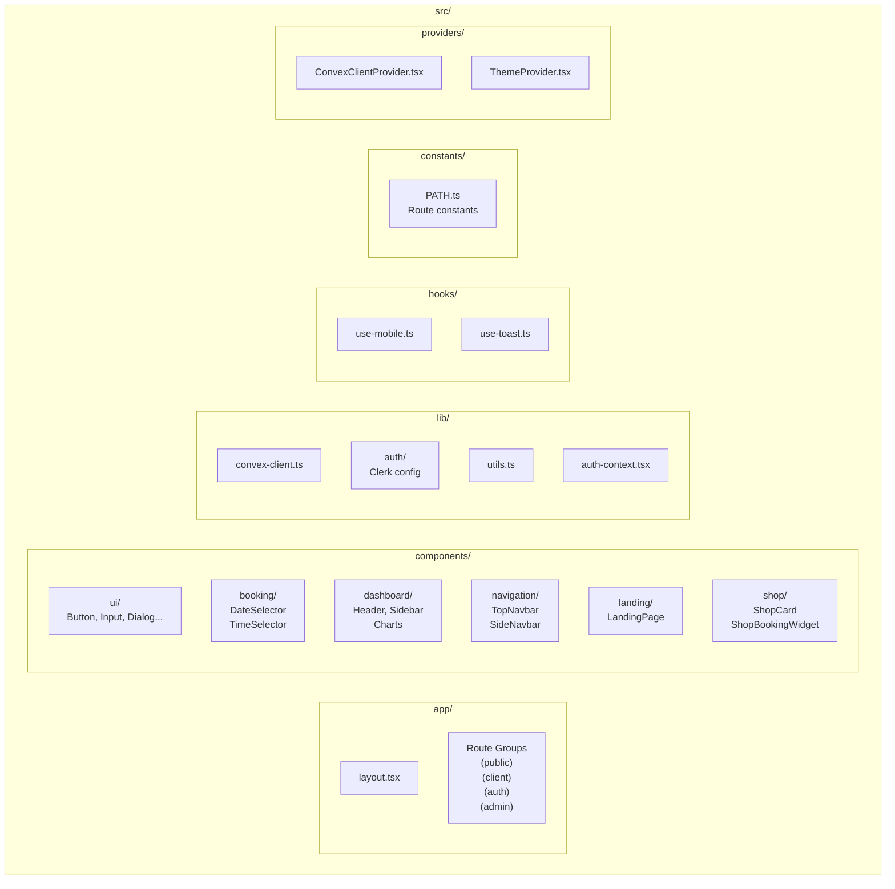

## 7. Backend Module Structure

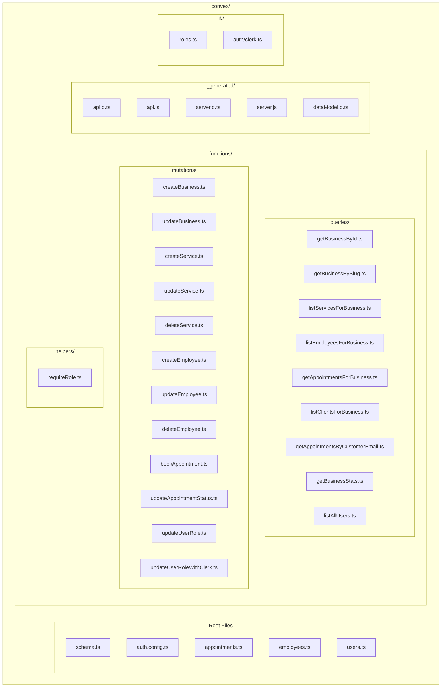

## 8. Request/Response Flow

### 8.1 Authentication Flow

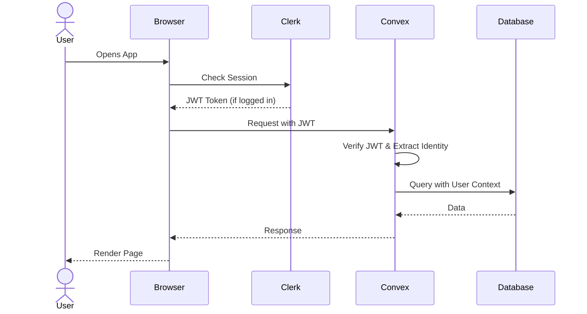

### 8.2 Booking Flow

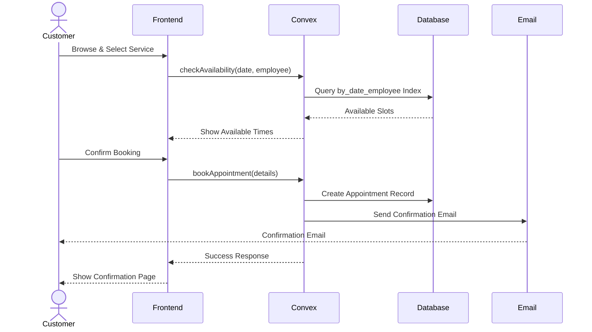

### 8.3 Service Management Flow

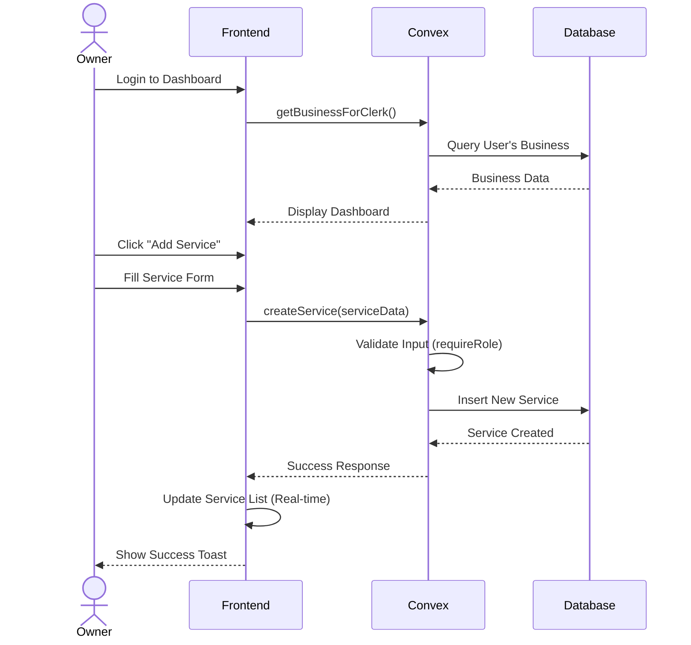

## 9. Database Schema Relationship

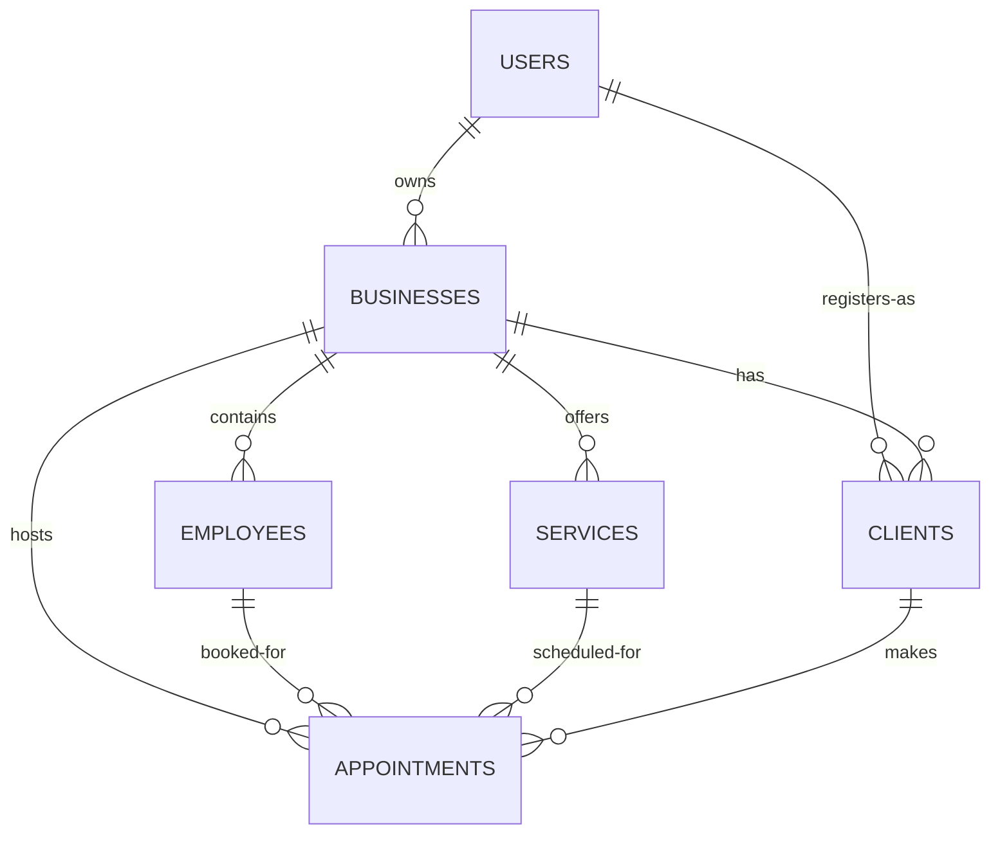

## 10. File Organization Summary

```
smart-booking-system/
├── src/
│   ├── app/
│   │   ├── (public)/          # Public routes (/, /shop/*, /user/*)
│   │   ├── (client)/          # Client routes (/client/*)
│   │   ├── (admin)/           # Admin routes (/admin/*)
│   │   ├── (auth)/            # Auth routes (/sign-in, /sign-up)
│   │   └── api/               # API routes
│   ├── components/
│   │   ├── ui/                # shadcn/ui components
│   │   ├── booking/           # Booking widgets
│   │   ├── dashboard/         # Dashboard components
│   │   ├── navigation/        # Nav components
│   │   ├── landing/           # Landing page
│   │   └── shop/              # Shop components
│   ├── lib/
│   │   ├── convex-client.ts   # Convex client instance
│   │   ├── auth-context.tsx   # Auth context
│   │   ├── utils.ts           # Utilities
│   │   └── auth/              # Auth helpers
│   ├── hooks/                 # Custom React hooks
│   ├── constants/             # Constants (paths, etc)
│   ├── providers/             # Context providers
│   └── middleware.ts          # Route protection
├── convex/
│   ├── schema.ts              # Database schema definition
│   ├── auth.config.ts         # Clerk config
│   ├── functions/
│   │   ├── queries/           # Read operations
│   │   ├── mutations/         # Write operations
│   │   └── helpers/           # Helper functions
│   ├── lib/                   # Backend utilities
│   └── _generated/            # Auto-generated types
├── public/                    # Static assets
└── package.json               # Dependencies
```

## 11. Technology Stack Structure

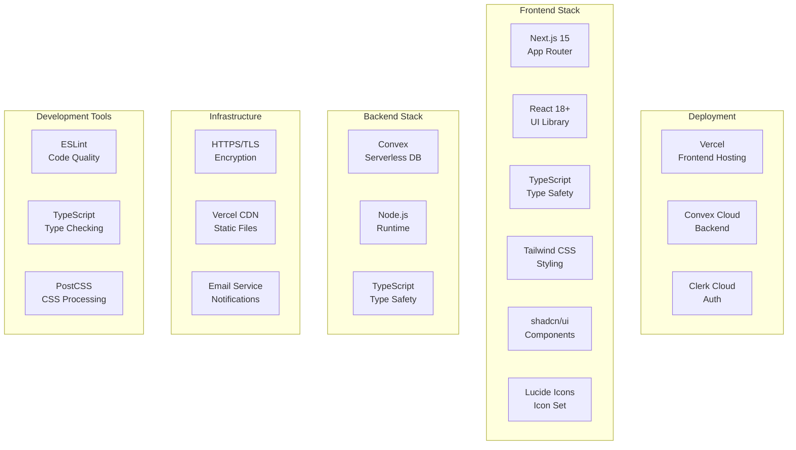

## 12. Component Dependencies

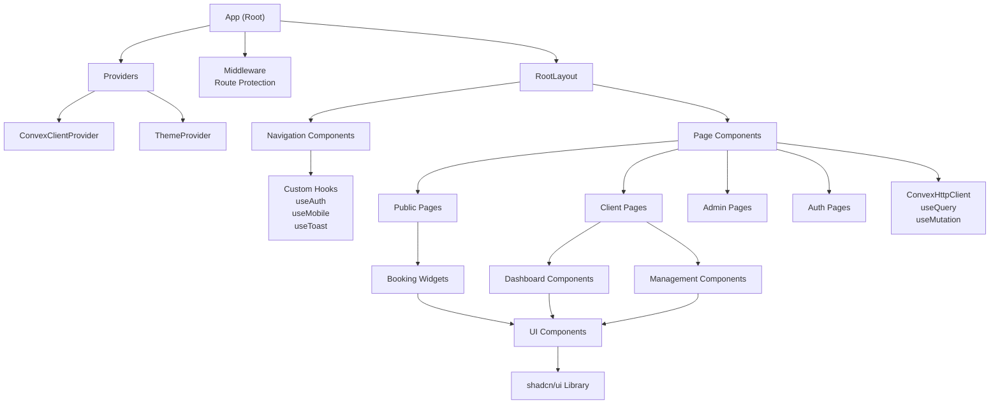

---

This comprehensive structure chart provides a complete overview of the Smart Booking System's organization, from high-level architecture down to individual file locations and component relationships.
